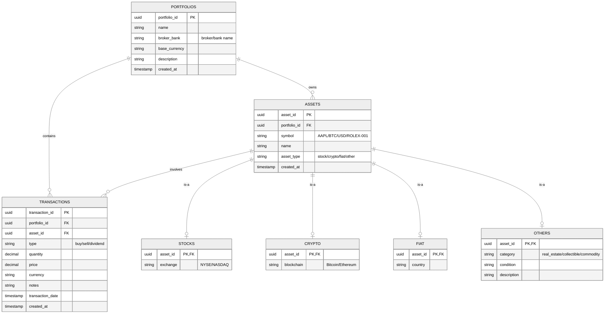

```mermaid

%%{
  init: {
    'theme': 'neutral'
  }
}%%

erDiagram
   PORTFOLIOS {
       uuid portfolio_id PK
       string name
       string broker_bank "broker/bank name"
       string base_currency
       string description
       timestamp created_at
   }

   ASSETS {
       uuid asset_id PK
       uuid portfolio_id FK
       string symbol "AAPL/BTC/USD/ROLEX-001"
       string name
       string asset_type "stock/crypto/fiat/other"
       timestamp created_at
   }

   STOCKS {
       uuid asset_id PK, FK
       string exchange "NYSE/NASDAQ"
   }

   CRYPTO {
       uuid asset_id PK, FK
       string blockchain "Bitcoin/Ethereum"
   }

   FIAT {
       uuid asset_id PK, FK
       string country
   }

   OTHERS {
       uuid asset_id PK, FK
       string category "real_estate/collectible/commodity"
       string condition
       string description
   }

   TRANSACTIONS {
       uuid transaction_id PK
       uuid portfolio_id FK
       uuid asset_id FK
       string type "buy/sell/dividend"
       decimal quantity
       decimal price
       string currency
       string notes
       timestamp transaction_date
       timestamp created_at
   }

   %% Relationships
   PORTFOLIOS ||--o{ ASSETS : owns
   PORTFOLIOS ||--o{ TRANSACTIONS : contains
   ASSETS ||--o{ TRANSACTIONS : involves
   ASSETS ||--o| STOCKS : "is-a"
   ASSETS ||--o| CRYPTO : "is-a"
   ASSETS ||--o| FIAT : "is-a"
   ASSETS ||--o| OTHERS : "is-a"
```